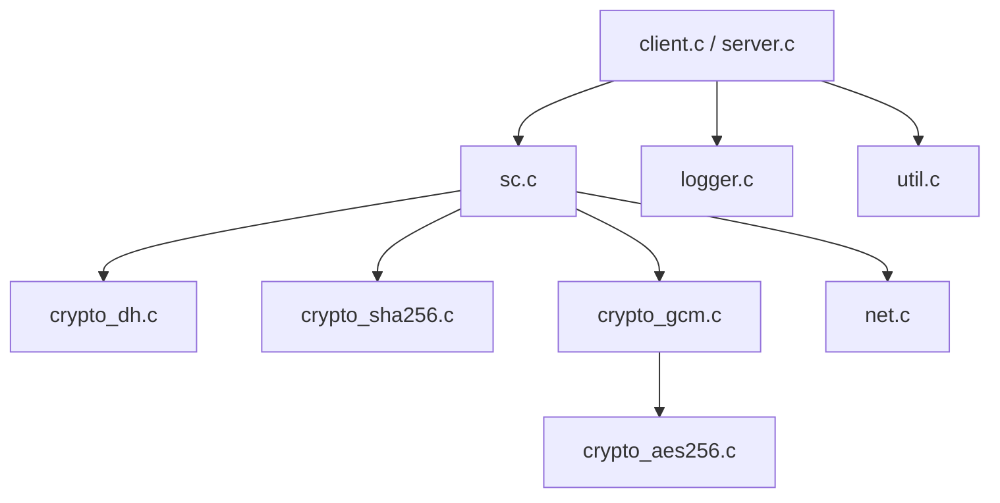
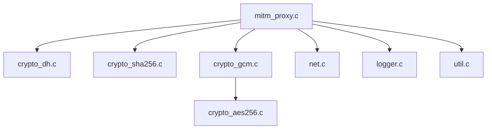
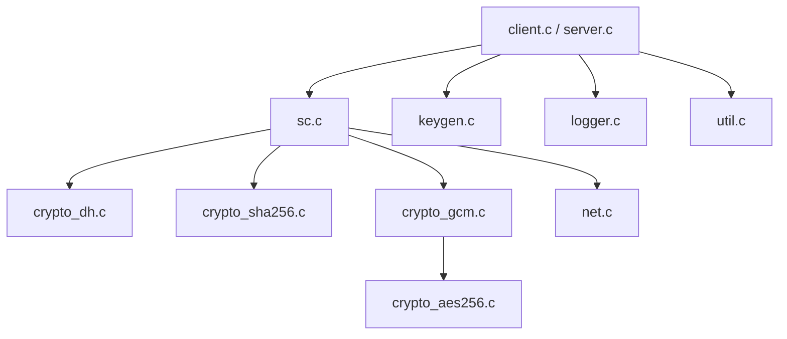
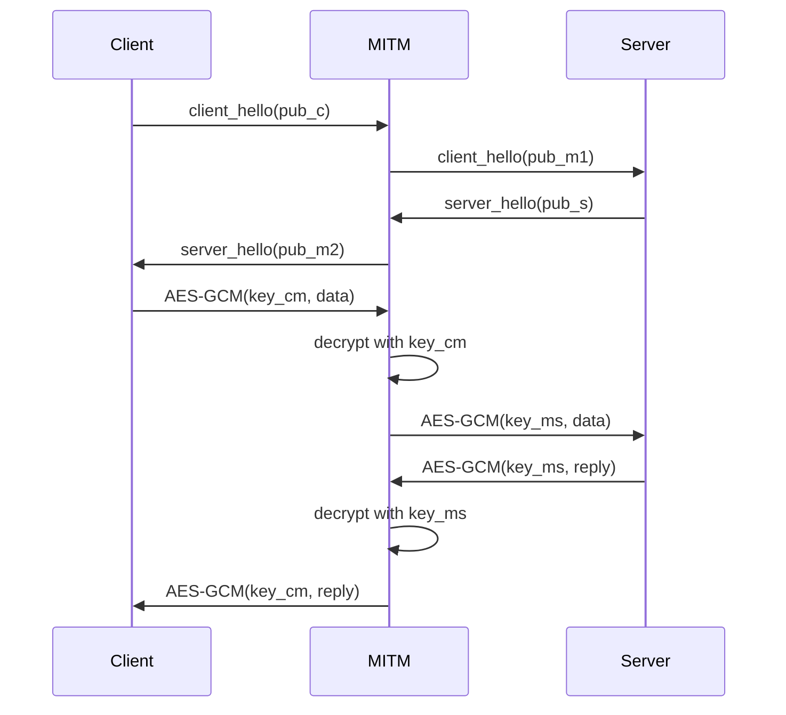
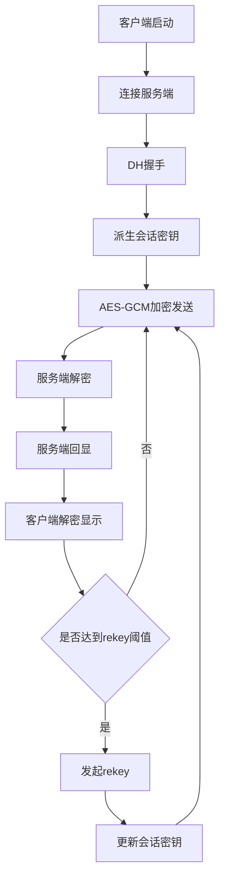
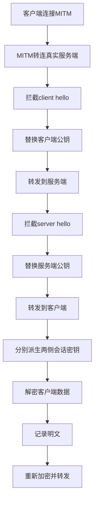
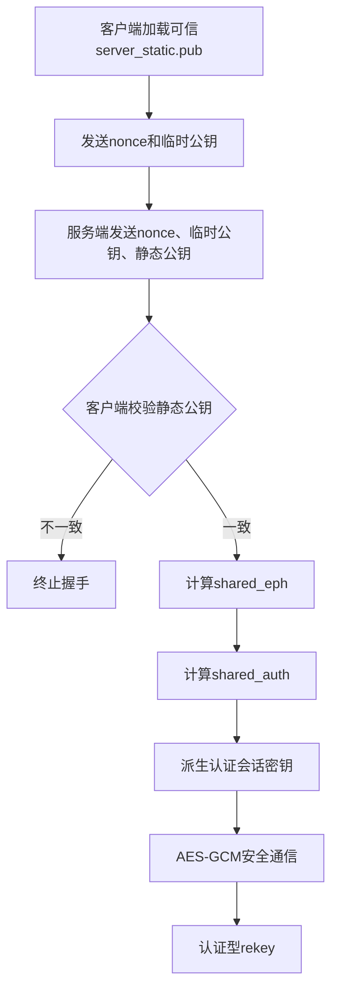

# 网络与系统安全课程设计报告

## 1. 基本信息

- 题目：基于 Diffie-Hellman 的安全通信系统设计、攻击实现与协议改进
- 开发环境：Linux
- 开发语言：C
- 编译方式：`Makefile`
- 项目目录：`network-security-cs`
- 项目阶段：
  - `stage1_dh`：Diffie-Hellman 协议实现
  - `stage2_mitm`：Diffie-Hellman 中间人攻击实现
  - `stage3_improved`：认证型 Diffie-Hellman 协议改进与验证

## 2. 课题背景与设计目标

本课程设计围绕网络与系统安全中的安全通信机制展开，要求在 Linux 环境下使用 C 语言完成一个分阶段演进的客户端/服务器通信系统。项目需要从基础的 TCP Socket 通信出发，逐步加入密钥协商、加密传输、中间人攻击分析以及抗中间人攻击的协议改进机制，从而形成一个完整的“设计 - 攻击 - 防御 - 验证”实验闭环。

本项目的总体目标如下：

1. 实现基于 TCP Socket 的客户端/服务端通信原型。
2. 实现 Diffie-Hellman 密钥协商机制，使通信双方在不直接传输对称密钥的情况下协商出共享密钥。
3. 使用 AES-256-GCM 对业务数据进行加密和完整性保护。
4. 支持周期性密钥更新，使会话密钥能够动态轮换。
5. 研究 Diffie-Hellman 无认证握手的安全缺陷，实现中间人攻击程序，并使其可解密通信数据。
6. 对协议进行改进，使其具备身份认证能力并抵抗中间人攻击。
7. 使用第二阶段的 MITM 程序对第三阶段改进协议进行验证，证明防御措施有效。

本项目的核心思想是：第一阶段建立一个“可运行的安全通信协议”，第二阶段证明其“在无认证条件下并不安全”，第三阶段再从协议设计层面补上身份认证，从而实现“可运行、可攻击、可防御、可验证”的完整实验体系。

## 3. 概要设计

### 3.1 总体架构

整个项目采用分阶段目录组织的方式，每个阶段均可独立编译、独立运行，结构清晰，便于逐步演示和版本管理。

```text
network-security-cs/
├── stage1_dh/
│   ├── include/
│   ├── src/
│   └── Makefile
├── stage2_mitm/
│   ├── include/
│   ├── src/
│   └── Makefile
├── stage3_improved/
│   ├── include/
│   ├── src/
│   └── Makefile
├── README.md
└── COURSE_DESIGN_REPORT.md
```

### 3.2 功能模块划分

三个阶段均采用模块化设计，主要模块如下：

1. 网络通信模块 `net.c`
   - 提供 TCP 监听、连接、接收、发送、定长收发和帧封装函数。
   - 负责底层 Socket 细节，对上层协议模块屏蔽网络收发复杂性。

2. 工具与辅助模块 `util.c`
   - 提供随机数、文件读写、参数转换、守护进程化等辅助功能。

3. 日志模块 `logger.c`
   - 用于记录握手、派生、加密、解密、重协商、中间人攻击等详细流程。
   - 既服务于调试，也服务于课程设计报告截图和验收展示。

4. Diffie-Hellman 模块 `crypto_dh.c`
   - 实现密钥对生成、公钥计算、共享秘密计算。
   - 是会话密钥协商和认证型改进协议的核心数学基础。

5. SHA-256 模块 `crypto_sha256.c`
   - 用于 KDF 密钥派生和其他哈希用途。

6. AES-256 模块 `crypto_aes256.c`
   - 提供 AES-256 分组加密基础实现。

7. GCM 模块 `crypto_gcm.c`
   - 在 AES-256 基础上实现 GCM 模式，提供机密性和完整性保护。

8. 安全会话模块 `sc.c`
   - 第一阶段与第三阶段的核心模块。
   - 负责协议握手、会话密钥派生、加密发送、解密接收和周期性 rekey。

9. 客户端/服务端主程序
   - `client.c`：负责参数解析、连接建立、调用握手并发送业务消息。
   - `server.c`：负责监听连接、创建工作线程并处理会话。

10. MITM 模块 `mitm_proxy.c`
   - 第二阶段核心模块。
   - 负责拦截握手、替换公钥、分别协商密钥、解密与重加密转发。

11. 密钥生成模块 `keygen.c`
   - 第三阶段新增。
   - 用于在运行时生成服务端长期静态密钥对，避免“双方直接写死同一密码”。

### 3.3 抽象数据类型定义

#### 3.3.1 第一阶段会话结构

第一阶段安全会话结构定义如下：

```c
struct sc_session {
    uint8_t key[32];
    uint32_t salt;
    uint64_t send_seq;
    uint64_t recv_seq;
    uint32_t rekey_every;
    uint32_t sent_since_rekey;
};
```

各字段含义如下：

- `key[32]`：当前会话使用的 256 位 AES-GCM 密钥。
- `salt`：根据双端随机数派生出的 IV 前缀参数。
- `send_seq`：发送方向的报文序号，用于生成唯一 IV 和 AAD。
- `recv_seq`：接收方向的报文序号，用于检测乱序和保证解密一致性。
- `rekey_every`：每发送多少条消息触发一次密钥更新。
- `sent_since_rekey`：自上次更新后已发送消息数。

#### 3.3.2 第三阶段会话结构

第三阶段在第一阶段的基础上加入服务端静态密钥相关字段：

```c
struct sc_session {
    uint8_t key[32];
    uint32_t salt;
    uint64_t send_seq;
    uint64_t recv_seq;
    uint32_t rekey_every;
    uint32_t sent_since_rekey;

    uint8_t server_static_pub[32];
    uint8_t server_static_priv[32];
    int has_static_priv;
};
```

新增字段说明如下：

- `server_static_pub[32]`：服务端静态公钥。客户端用于身份验证，服务端用于对外发送。
- `server_static_priv[32]`：服务端静态私钥。仅服务端持有，用于生成认证共享量。
- `has_static_priv`：标识当前会话是否具备服务端静态私钥。

#### 3.3.3 服务端工作线程参数

```c
struct worker_args {
    int fd;
};
```

该结构用于把已接受的套接字描述符传递给工作线程，实现服务端多线程并发处理。

#### 3.3.4 第二阶段中间人上下文结构

第二阶段 MITM 程序定义了上下文结构和重协商暂存结构，用于维护中间人两侧的状态：

```c
struct rekey_pending {
    int active;
    uint8_t n_c[16];
    uint8_t pub_c[32];
    uint8_t priv_to_server[32];
    uint8_t pub_to_server[32];
    uint8_t priv_to_client[32];
    uint8_t pub_to_client[32];
};

struct mitm_ctx {
    uint8_t key_client[32];
    uint8_t key_server[32];
    uint32_t salt;
    int raw_forward;
    int switch_pending;
    uint8_t next_key_client[32];
    uint8_t next_key_server[32];
    uint32_t next_salt;
    uint8_t n_c[16];
    uint8_t n_s[16];
    struct rekey_pending pending;
};
```

其作用是保存：

- 中间人与客户端之间的会话密钥。
- 中间人与服务端之间的会话密钥。
- 当前与下一轮 rekey 的切换状态。
- 握手随机数和双方公钥信息。

### 3.4 模块层次与调用关系

#### 3.4.1 第一阶段调用关系



#### 3.4.2 第二阶段调用关系



#### 3.4.3 第三阶段调用关系



### 3.5 主程序流程

#### 3.5.1 第一阶段客户端流程

1. 解析命令行参数。
2. 与服务端建立 TCP 连接。
3. 进行 Diffie-Hellman 握手，协商会话密钥。
4. 使用 AES-256-GCM 加密发送应用数据。
5. 接收服务端回显并解密。
6. 达到阈值时发起周期性 rekey。
7. 记录完整日志并退出。

#### 3.5.2 第一阶段服务端流程

1. 解析命令行参数。
2. 建立监听 Socket。
3. 接收客户端连接。
4. 为每个连接创建线程。
5. 在线程中执行握手、接收密文、解密明文、回显密文。
6. 在会话内处理重协商请求。

#### 3.5.3 第二阶段中间人流程

1. 监听客户端连接，同时连接真实服务端。
2. 截获客户端握手消息。
3. 替换客户端公钥后转发给服务端。
4. 截获服务端握手消息。
5. 替换服务端公钥后转发给客户端。
6. 分别与双方建立不同会话密钥。
7. 截获数据帧，先解密得到明文，再重新加密后转发。
8. 对 rekey 控制帧也执行同样的拦截与替换。

#### 3.5.4 第三阶段改进协议流程

1. 使用 `keygen` 生成服务端长期静态密钥对。
2. 客户端预先持有可信的服务端静态公钥文件。
3. 握手时客户端发送临时公钥与随机数。
4. 服务端返回随机数、临时公钥和静态公钥。
5. 客户端校验收到的静态公钥是否与本地可信副本一致。
6. 双方分别计算 `shared_eph` 和 `shared_auth`。
7. 使用 `shared_eph + shared_auth + nonce` 派生会话密钥。
8. 使用 AES-256-GCM 加密通信，并支持认证型 rekey。

### 3.6 技术开发思路

本项目采用分阶段增量开发方式，核心技术思路如下：

1. 先实现最小可运行 TCP C/S 框架。
2. 再在应用层设计简单的帧格式，实现握手与密文传输。
3. 使用临时 DH 产生共享秘密，并配合 SHA-256 派生出 256 位会话密钥。
4. 使用 AES-256-GCM 对每条消息进行机密性和完整性保护。
5. 用消息计数触发 rekey，验证密钥更新能力。
6. 基于第一阶段协议缺乏认证这一弱点，设计 MITM 程序实现双边建钥。
7. 在第三阶段引入“服务端长期静态密钥 + 客户端预置信任公钥”机制，实现认证型 DH。
8. 使用第二阶段攻击程序对第三阶段再次测试，证明协议改进有效。

## 4. 详细设计

### 4.1 协议报文设计

#### 4.1.1 报文类型

项目中定义了如下协议类型：

```c
MSG_CLIENT_HELLO = 0x01
MSG_SERVER_HELLO = 0x02
MSG_DATA         = 0x10
MSG_CTRL         = 0x11

CTRL_REKEY_INIT  = 0x01
CTRL_REKEY_REPLY = 0x02
```

#### 4.1.2 第一阶段握手报文

客户端握手报文：

```text
+--------+-----------+--------------+
| 1 byte | 16 bytes  | 32 bytes     |
+--------+-----------+--------------+
| type   | nonce_c   | client_pub   |
+--------+-----------+--------------+
```

服务端握手报文：

```text
+--------+-----------+--------------+
| 1 byte | 16 bytes  | 32 bytes     |
+--------+-----------+--------------+
| type   | nonce_s   | server_pub   |
+--------+-----------+--------------+
```

#### 4.1.3 第三阶段握手报文

第三阶段服务端返回报文增加了静态公钥：

```text
+--------+-----------+--------------+-------------------+
| 1 byte | 16 bytes  | 32 bytes     | 32 bytes          |
+--------+-----------+--------------+-------------------+
| type   | nonce_s   | server_e_pub | server_static_pub |
+--------+-----------+--------------+-------------------+
```

这样客户端就能在握手阶段完成“身份验证 + 密钥协商”的结合。

#### 4.1.4 加密数据帧格式

所有业务数据与控制数据均采用统一帧格式：

```text
+--------+----------+----------+----------+-------------+
| 1 byte | 8 bytes  | 12 bytes | 16 bytes | variable    |
+--------+----------+----------+----------+-------------+
| type   | seq      | iv       | tag      | ciphertext  |
+--------+----------+----------+----------+-------------+
```

其中：

- `type`：数据类型或控制类型。
- `seq`：消息序号。
- `iv`：GCM 模式随机向量，由 `salt + seq` 组合得到。
- `tag`：GCM 认证标签。
- `ciphertext`：加密密文。

### 4.2 第一阶段关键技术实现

#### 4.2.1 会话密钥派生

第一阶段会话密钥由一个临时 DH 共享量和双方随机数派生：

```text
shared = DH(client_priv, server_pub)
key = SHA256(shared || nonce_c || nonce_s)
salt = SHA256(nonce_c || nonce_s) 的前 4 字节
```

设计原因如下：

1. 不直接使用 DH 原始输出作为对称密钥，避免结构性风险。
2. 引入双方随机数，提高每轮会话的独立性。
3. 使用 `salt + seq` 构造 IV，保证 GCM 每条消息使用不同 IV。

#### 4.2.2 数据加密与解密

发送时：

1. 根据 `salt` 和 `send_seq` 生成 12 字节 IV。
2. 构造 AAD：`type || seq`。
3. 调用 AES-256-GCM 进行加密。
4. 将 `type + seq + iv + tag + ciphertext` 封装成帧发送。
5. 发送成功后 `send_seq++`。

接收时：

1. 解析出 `type、seq、iv、tag、ciphertext`。
2. 重新构造相同 AAD。
3. 使用当前会话密钥进行 GCM 解密和 tag 校验。
4. 若校验通过则得到明文，否则报错。
5. 更新 `recv_seq`。

#### 4.2.3 周期性 rekey 设计

当 `sent_since_rekey >= rekey_every` 时，客户端发起重协商：

1. 客户端重新生成临时 DH 密钥对和新的随机数。
2. 发送 `CTRL_REKEY_INIT` 控制消息。
3. 服务端收到后生成新的临时密钥对和随机数，并回复 `CTRL_REKEY_REPLY`。
4. 双方根据新的共享量和随机数重新派生会话密钥。
5. 将序号清零，重新开始计数。

该设计可以缩短单个会话密钥的使用时间，降低长期密钥暴露风险。

### 4.3 第二阶段中间人攻击实现

#### 4.3.1 攻击原理

普通 Diffie-Hellman 的核心问题是“协商了密钥，但没有验证身份”。如果攻击者位于通信链路中间，则可以：

1. 拦截客户端发给服务端的临时公钥。
2. 不把原公钥转发给服务端，而是换成攻击者自己的公钥。
3. 拦截服务端返回给客户端的临时公钥。
4. 同样换成攻击者自己的另一组公钥。

这样，客户端实际与攻击者协商出一把密钥，服务端也与攻击者协商出另一把密钥。虽然客户端和服务端都以为自己是在和对方协商，但实际上双方从未共享同一把会话密钥。

此时攻击者可执行以下操作：

1. 用与客户端协商出的密钥解密客户端消息。
2. 获得明文后打印、分析或篡改。
3. 再用与服务端协商出的密钥重新加密。
4. 将新密文转发给服务端。

服务端回包时也重复同样过程，因此中间人可以持续观察双方明文。

#### 4.3.2 攻击流程图



#### 4.3.3 攻击程序设计要点

1. 中间人需要保存两套会话密钥：
   - `key_client`：用于解密/加密客户端方向数据。
   - `key_server`：用于解密/加密服务端方向数据。

2. 中间人需要维护双方序号与 IV 一致性。

3. 中间人在 rekey 时不能简单转发，而要继续拦截控制消息，重新替换临时公钥并派生新密钥。

4. 为方便实验展示，程序提供详细日志和明文十六进制输出。

### 4.4 第三阶段协议改进设计

#### 4.4.1 设计目标

第三阶段的目标是解决第一阶段中的本质漏洞，即“只有密钥协商，没有身份认证”。设计要求明确指出不能采用“两端直接写死共享密码”的方式，因此本项目采用如下方案：

1. 服务端运行时生成长期静态 DH 密钥对。
2. 客户端本地保存可信的服务端静态公钥。
3. 握手时服务端返回“临时公钥 + 静态公钥”。
4. 客户端校验静态公钥后，再与服务端完成认证型密钥派生。

#### 4.4.2 改进后的密钥派生

第三阶段不再只使用一个共享量，而是同时使用两个共享量：

```text
shared_eph  = DH(client_eph_priv, server_eph_pub)
shared_auth = DH(client_eph_priv, server_static_pub)
session_key = SHA256(shared_eph || shared_auth || nonce_c || nonce_s)
```

服务端对应计算为：

```text
shared_eph  = DH(server_eph_priv, client_eph_pub)
shared_auth = DH(server_static_priv, client_eph_pub)
session_key = SHA256(shared_eph || shared_auth || nonce_c || nonce_s)
```

该设计具有如下意义：

1. `shared_eph` 保留了临时 DH 的前向安全特性。
2. `shared_auth` 引入了服务端长期身份绑定。
3. 中间人若没有服务端静态私钥，就无法构造正确的 `shared_auth`。
4. 因此中间人即使篡改了临时公钥，也无法让双方得到同一把会话密钥。

#### 4.4.3 为什么不属于“写死密码”

本设计不是把同一个对称密码写死在客户端和服务端代码中，原因如下：

1. 服务端静态密钥由 `keygen` 程序运行时随机生成，不是写死在源代码里的常量。
2. 客户端保存的是服务端公钥，目的是验证身份，不是对称通信密钥。
3. 真正用于 AES-256-GCM 的会话密钥仍由每次握手动态计算生成。

因此，该方案属于“预置信任公钥的认证型 DH”，而不是“预共享对称密码”。

#### 4.4.4 第三阶段验证方式

为了证明改进有效，本项目直接复用第二阶段 `mitm_proxy` 程序，对第三阶段进行两种验证：

1. `stage3-passive`
   - 代理存在，但不篡改服务端静态身份相关信息。
   - 结果应为通信正常。

2. `stage3-attack`
   - 代理主动替换服务端临时公钥。
   - 结果应为客户端和服务端派生出的会话密钥不一致，后续通信失败，攻击者无法得到合法明文。

### 4.5 关键技术实现伪码

#### 4.5.1 第一阶段客户端握手伪码

```text
function client_handshake(fd):
    generate client_eph_priv, client_eph_pub
    generate nonce_c
    send MSG_CLIENT_HELLO(nonce_c, client_eph_pub)

    recv MSG_SERVER_HELLO(nonce_s, server_eph_pub)
    shared = DH(client_eph_priv, server_eph_pub)
    key = SHA256(shared || nonce_c || nonce_s)
    salt = HASH(nonce_c || nonce_s)[0:4]
    init session(key, salt, seq=0)
    return success
```

#### 4.5.2 第一阶段加密发送伪码

```text
function send_encrypted(fd, session, type, plaintext):
    iv = make_iv(session.salt, session.send_seq)
    aad = type || session.send_seq
    ciphertext, tag = AES256_GCM_Encrypt(session.key, iv, aad, plaintext)
    frame = type || seq || iv || tag || ciphertext
    send frame
    session.send_seq++
```

#### 4.5.3 第一阶段解密接收伪码

```text
function recv_decrypted(fd, session):
    frame = recv frame
    parse type, seq, iv, tag, ciphertext
    aad = type || seq
    plaintext = AES256_GCM_Decrypt(session.key, iv, aad, ciphertext, tag)
    if decrypt failed:
        return error
    session.recv_seq = seq + 1
    return plaintext
```

#### 4.5.4 第二阶段 MITM 握手伪码

```text
function mitm_handshake(client_fd, server_fd):
    recv client_hello(nonce_c, pub_c)
    generate mitm_to_server keypair
    replace pub_c with mitm_pub1
    send modified hello to server

    recv server_hello(nonce_s, pub_s)
    generate mitm_to_client keypair
    replace pub_s with mitm_pub2
    send modified hello to client

    key_client = KDF(DH(mitm_priv2, pub_c), nonce_c, nonce_s)
    key_server = KDF(DH(mitm_priv1, pub_s), nonce_c, nonce_s)
```

#### 4.5.5 第三阶段认证型握手伪码

```text
function client_auth_handshake(fd, trusted_server_pub):
    generate client_eph_priv, client_eph_pub
    generate nonce_c
    send MSG_CLIENT_HELLO(nonce_c, client_eph_pub)

    recv MSG_SERVER_HELLO(nonce_s, server_eph_pub, server_static_pub)
    if server_static_pub != trusted_server_pub:
        abort

    shared_eph  = DH(client_eph_priv, server_eph_pub)
    shared_auth = DH(client_eph_priv, trusted_server_pub)
    key = SHA256(shared_eph || shared_auth || nonce_c || nonce_s)
    init session(key, salt, seq=0)
    return success
```

### 4.6 流程图

#### 4.6.1 第一阶段正常通信流程图



#### 4.6.2 第二阶段 MITM 流程图



#### 4.6.3 第三阶段改进协议流程图



## 5. 调试分析

本部分是课程设计的重点。项目在实现过程中，最重要的不是“代码一次写对”，而是通过分层调试逐步定位问题。由于本课设同时涉及网络编程、密码学流程、帧格式设计和对抗性实验，因此调试时必须采用“分模块、分阶段、看日志、配断点”的方法。以下内容既是本项目的实际调试思路，也可直接写入报告作为调试分析和经验总结。

### 5.1 调试总体原则

调试本项目时，我采用以下原则：

1. 先网络，后密码，最后协议联调。
2. 先验证帧收发，再验证密钥一致，最后验证加解密结果。
3. 任何一个阶段都保留详细日志，不直接依赖肉眼猜测。
4. 遇到错误时先定位在哪一层：
   - 是 Socket 连接失败。
   - 还是握手报文格式错误。
   - 还是双方会话密钥不一致。
   - 还是 GCM 的 IV、AAD、tag 不匹配。
   - 还是 rekey 之后新旧密钥切换时序出错。

### 5.2 第一阶段的重点调试内容

#### 5.2.1 TCP 连接与帧收发调试

最开始应先保证最基础的 TCP 框架正常工作。可以优先调试如下函数：

- `net_listen_tcp`
- `net_accept`
- `net_connect_tcp`
- `net_send_frame`
- `net_recv_frame`

如果客户端无法连接服务端，应优先检查：

1. IP 和端口是否正确。
2. 服务端是否成功监听。
3. 是否被其他进程占用端口。
4. 帧长度字段是否收发一致。

建议观察位置：

- 服务端日志中的 `listen success`、`accepted connection`
- 客户端日志中的 `tcp connect success`

如果怀疑网络问题，可使用如下命令辅助调试：

```bash
ss -ltnp
ps -ef | grep server
```

#### 5.2.2 DH 握手调试

如果客户端和服务端握手后无法正常通信，应重点检查握手阶段双方是否得到了同一会话密钥。此时建议调试：

- 第一阶段：`sc_client_handshake`、`sc_server_handshake`
- DH 算法：`crypto_dh_keypair`、`crypto_dh_shared`

重点日志应检查：

1. 客户端和服务端生成的随机数。
2. 双方交换的公钥是否正确。
3. 共享秘密 `shared` 是否一致。
4. 派生出的会话密钥 `key` 是否一致。

如果共享秘密不同，则说明：

- DH 公钥被错误传输。
- DH 公式实现有问题。
- 字节序或缓冲区拷贝错误。

#### 5.2.3 AES-256-GCM 加解密调试

如果握手成功但后续解密失败，多数问题都集中在 GCM 参数不一致。此时应重点检查：

1. 双方使用的 `key` 是否完全一致。
2. 发送端和接收端的 `iv` 是否一致。
3. AAD 是否一致。
4. `seq` 是否同步。
5. 是否误用了旧密钥或错误的 tag。

最关键的调试点在：

- `send_encrypted`
- `recv_decrypted`

建议优先查看日志中的：

- `send session key`
- `send iv`
- `send aad`
- `send ciphertext`
- `send gcm tag`
- `recv iv`
- `recv aad`
- `recv session key`

如果 tag 校验失败，通常不是 AES 实现本身有错，而是“密钥、IV、AAD、密文”中至少有一个在两端不一致。

#### 5.2.4 Rekey 调试

rekey 是第一阶段最容易出错的部分。原因是双方在某个瞬间从旧密钥切换到新密钥，如果顺序稍有不一致，就会导致后续全部解密失败。

应重点观察：

- `do_rekey_client`
- `handle_rekey_server`

建议重点检查：

1. 客户端触发 rekey 的阈值是否正确。
2. 服务端是否把 rekey 报文当成业务数据错误处理。
3. 双方是否都基于新的随机数和新的临时公钥派生新密钥。
4. rekey 后 `send_seq` 和 `recv_seq` 是否清零。
5. rekey 后 `salt` 是否同步更新。

这是本项目里最值得在报告中强调的调试点，因为它体现了“身份认证及密钥更新实时性”的要求。

### 5.3 第二阶段的重点调试内容

#### 5.3.1 MITM 是否真的完成了“双边建钥”

第二阶段常见错误是：程序虽然拦截了数据，但并没有真正替换公钥或没有成功计算两边密钥，此时攻击者无法解密明文。

应重点调试：

- `do_handshake`
- `decrypt_frame`
- `encrypt_frame`

关键检查项如下：

1. 客户端原始公钥是否被替换为 `pub_to_server`。
2. 服务端原始公钥是否被替换为 `pub_to_client`。
3. `key_client` 与客户端端到 MITM 的实际密钥是否一致。
4. `key_server` 与 MITM 到服务端的实际密钥是否一致。

如果 MITM 只能转发但不能打印明文，则大概率是两侧某一边会话密钥派生错了。

#### 5.3.2 MITM 中 rekey 的调试难点

第二阶段中，MITM 不能只处理初始握手，还要处理 rekey。否则只要通信双方重协商一次，攻击就会失效。

因此我在调试中重点关注了：

1. 客户端发出的 `CTRL_REKEY_INIT` 是否被 MITM 拦截。
2. MITM 是否重新生成两组新的临时公钥。
3. 服务端回复 `CTRL_REKEY_REPLY` 后，MITM 是否能完成下一轮会话密钥切换。
4. `switch_pending` 和 `pending` 状态是否按时清除。

这里的经验是：MITM 的 rekey 调试比正常协议更复杂，因为它维护的是“两套会话状态”，而不是一套。

### 5.4 第三阶段的重点调试内容

#### 5.4.1 认证逻辑调试

第三阶段的关键不再只是“算出密钥”，而是“验证身份后再算密钥”。因此应重点检查：

1. 客户端是否正确读取了 `server_static.pub`。
2. 服务端是否正确读取了 `server_static.key` 并推出静态公钥。
3. 服务端在握手回复中发送的静态公钥是否正确。
4. 客户端是否真的执行了静态公钥比对，而不是只接收不验证。

关键调试函数如下：

- `keygen`
- `sc_client_handshake`
- `sc_server_handshake`

最关键的日志应查看：

- `loaded trusted server public key`
- `server advertised static pub`
- `authenticated client handshake static public key verified`
- `client shared_auth`
- `server shared_auth`

#### 5.4.2 为什么 MITM 攻击在第三阶段失败

第三阶段调试时最重要的问题是：如何证明“攻击失败是因为认证机制生效”，而不是程序偶然崩溃。

正确的验证思路是：

1. 启动 `stage3-passive` 模式，确认有代理存在时正常通信。
2. 再启动 `stage3-attack` 模式，让代理替换临时公钥。
3. 检查代理是否打印了 `stage3 attack injected`。
4. 检查客户端或服务端是否在后续阶段出现认证失败或加解密失败。
5. 检查代理是否仍无法得到可用明文。

若上述现象同时满足，才能说明是协议改进真正抵御了中间人，而不是简单的连接异常。

### 5.5 建议的调试方法与断点位置

如果需要进一步人工单步调试，我建议使用 `gdb` 配合日志。推荐断点位置如下：

#### 第一阶段

```bash
gdb ./bin/client
break sc_client_handshake
break send_encrypted
break do_rekey_client
run --host 127.0.0.1 --port 9000 --message hello --count 1 --rekey-every 1
```

```bash
gdb ./bin/server
break sc_server_handshake
break recv_decrypted
break handle_rekey_server
run --host 0.0.0.0 --port 9000
```

#### 第二阶段

```bash
gdb ./bin/mitm_proxy
break do_handshake
break decrypt_frame
break encrypt_frame
run --listen 127.0.0.1 --lport 9001 --target 127.0.0.1 --tport 9000 --mode stage1
```

#### 第三阶段

```bash
gdb ./bin/client
break sc_client_handshake
break do_rekey_client
run --host 127.0.0.1 --port 9101 --server-pub server_static.pub --message auth-log --count 1 --rekey-every 1
```

```bash
gdb ./bin/server
break sc_server_handshake
break handle_rekey_server
run --host 0.0.0.0 --port 9100 --static-key server_static.key
```

调试时建议重点打印变量：

- `key`
- `shared`
- `shared_eph`
- `shared_auth`
- `salt`
- `send_seq`
- `recv_seq`
- `iv`
- `tag`

### 5.6 我认为第 3 部分可以重点写的高分点

对于报告中的“调试分析”，我建议你重点突出以下几点，因为这些内容最能体现你确实做过实现、联调和分析：

1. **分层调试思想**
   - 先确认网络是否连通，再确认握手是否一致，最后确认加解密和 rekey 是否正确。

2. **日志驱动调试**
   - 本项目不是只看终端输出，而是把握手、公钥、随机数、共享量、会话密钥、IV、AAD、tag、rekey 都写入日志，因此可以完整复现实验过程。

3. **阶段二证明阶段一存在安全缺陷**
   - 报告中要强调：阶段二不是独立程序，而是对阶段一协议安全性的攻击验证，说明“没有认证的 DH 不安全”。

4. **阶段三不是简单修补，而是协议层面的改进**
   - 应强调阶段三不是“换个端口重新跑”，而是通过引入静态身份绑定，从协议层防止 MITM 伪装。

5. **rekey 是系统实现难点**
   - 很多同学只做到一次握手，你的项目支持重协商，并且第二阶段和第三阶段都考虑了 rekey，这一点很值得在报告中强调。

### 5.7 经验体会与改进设想

通过本次课程设计，我有以下体会：

1. 仅有“加密”并不等于“安全”，身份认证同样重要。
2. Diffie-Hellman 的理论很经典，但若在工程中忽略身份验证，就很容易受到中间人攻击。
3. AES-GCM 的安全实现高度依赖 IV、AAD 和序号的一致性，任何细节错误都会导致解密失败。
4. 详细日志对密码协议调试非常重要，因为许多错误不是程序崩溃，而是双方状态不同步。
5. 将协议拆分为多个源文件、多个阶段目录和独立模块后，调试效率明显提高，也更符合工程实践。

后续还可以进行如下改进：

1. 用数字签名替代“直接发送静态公钥”，由服务端对握手 transcript 进行签名，进一步提高规范性。
2. 引入证书链或自签 CA 机制，使客户端不必手工分发服务端公钥文件。
3. 增加重放攻击检测和超时重传机制。
4. 对敏感内存做显式清零，增强密钥材料生命周期管理。
5. 加入自动化测试脚本，覆盖握手、rekey、MITM 和认证失败场景。

## 6. 测试结果

### 6.1 测试环境

- 操作系统：Linux
- 编译工具：`gcc` + `Makefile`
- 运行方式：单台 Linux 虚拟机，打开多个终端分别运行服务端、客户端和中间人程序

### 6.2 编译结果

三个阶段分别进入目录执行：

```bash
cd stage1_dh && make
cd ../stage2_mitm && make
cd ../stage3_improved && make
```

均能成功生成可执行文件，说明项目结构、头文件依赖和编译过程正确。

### 6.3 第一阶段测试

#### 6.3.1 测试目的

验证以下功能是否正确：

1. TCP Socket 通信。
2. DH 协商。
3. AES-256-GCM 加密传输。
4. 服务端解密回显。
5. 周期性 rekey。

#### 6.3.2 测试命令

服务端：

```bash
cd stage1_dh
./bin/server --host 127.0.0.1 --port 9000 --log-file stage1_server_demo.log
```

客户端：

```bash
cd stage1_dh
./bin/client --host 127.0.0.1 --port 9000 --message "hello-log" --count 1 --rekey-every 1 --log-file stage1_client_demo.log
```

#### 6.3.3 测试现象

1. 客户端与服务端建立 TCP 连接成功。
2. 双方握手后派生出相同会话密钥。
3. 客户端发送的业务数据在网络上以密文形式传输。
4. 服务端成功解密、回显。
5. 客户端触发 rekey 后双方重新协商成功。

#### 6.3.4 结果分析

第一阶段验证了基础协议实现正确，满足题目中“DH 协商 + AES-256-GCM + 周期性密钥更新”的要求。

### 6.4 第二阶段测试

#### 6.4.1 测试目的

验证无认证 DH 协议可以被中间人攻击程序成功破坏，且 MITM 可解密通信明文。

#### 6.4.2 测试命令

真实服务端：

```bash
cd stage1_dh
./bin/server --host 127.0.0.1 --port 9000 --log-file stage1_server_demo.log
```

MITM：

```bash
cd stage2_mitm
./bin/mitm_proxy --listen 127.0.0.1 --lport 9001 --target 127.0.0.1 --tport 9000 --mode stage1 --log-file stage2_mitm_demo.log
```

客户端：

```bash
cd stage1_dh
./bin/client --host 127.0.0.1 --port 9001 --message "attack-demo" --count 1 --rekey-every 1 --log-file stage1_client_demo.log
```

#### 6.4.3 测试现象

1. MITM 成功拦截握手并替换公钥。
2. MITM 分别与客户端和服务端协商出不同会话密钥。
3. MITM 日志中可看到解出的应用明文。
4. 客户端与服务端均未察觉自己是在与攻击者分别建立会话。

#### 6.4.4 结果分析

第二阶段证明：若 DH 协议缺乏身份认证，仅靠密钥交换本身无法抵御中间人攻击。

### 6.5 第三阶段测试

#### 6.5.1 测试目的

验证改进后的认证型 DH 协议能够抵御第二阶段的 MITM 攻击。

#### 6.5.2 测试命令

生成静态密钥：

```bash
cd stage3_improved
./bin/keygen --priv server_static.key --pub server_static.pub --log-file stage3_keygen_demo.log
```

服务端：

```bash
cd stage3_improved
./bin/server --host 127.0.0.1 --port 9100 --static-key server_static.key --log-file stage3_server_demo.log
```

被动代理验证：

```bash
cd stage2_mitm
./bin/mitm_proxy --listen 127.0.0.1 --lport 9101 --target 127.0.0.1 --tport 9100 --mode stage3-passive --log-file stage3_mitm_passive_demo.log
```

客户端：

```bash
cd stage3_improved
./bin/client --host 127.0.0.1 --port 9101 --server-pub server_static.pub --message "auth-log" --count 1 --rekey-every 1 --log-file stage3_client_passive_demo.log
```

主动攻击验证：

```bash
cd stage2_mitm
./bin/mitm_proxy --listen 127.0.0.1 --lport 9101 --target 127.0.0.1 --tport 9100 --mode stage3-attack --log-file stage3_mitm_attack_demo.log
```

```bash
cd stage3_improved
./bin/client --host 127.0.0.1 --port 9101 --server-pub server_static.pub --message "auth-log" --count 1 --rekey-every 1 --log-file stage3_client_attack_demo.log
```

#### 6.5.3 测试现象

1. 在 `stage3-passive` 模式下，代理仅透明转发，通信可正常完成。
2. 在 `stage3-attack` 模式下，MITM 会输出 `stage3 attack injected`，说明其已经尝试篡改握手。
3. 但客户端和服务端由于无法得到一致的认证会话密钥，后续通信失败。
4. MITM 无法像第二阶段那样持续打印合法明文。

#### 6.5.4 结果分析

第三阶段证明：在 DH 协议中引入身份认证后，中间人即使位于通信路径中，也不能伪造受信任的服务端身份，因此攻击失效。

### 6.6 建议截图内容

为便于纸质报告和验收展示，建议截图如下：

1. 第一阶段：
   - 客户端和服务端正常通信终端图。
   - 握手与 rekey 日志图。
   - AES-GCM 密文、tag、明文日志图。

2. 第二阶段：
   - MITM 拦截握手和替换公钥日志图。
   - MITM 解出的应用明文图。
   - rekey 攻击继续生效的日志图。

3. 第三阶段：
   - `keygen` 生成静态密钥图。
   - 客户端验证静态公钥成功图。
   - `stage3-passive` 正常通信图。
   - `stage3-attack` 注入攻击但通信失败图。

## 7. 附录

### 7.1 源文件清单

#### 第一阶段

- `stage1_dh/src/client.c`
- `stage1_dh/src/server.c`
- `stage1_dh/src/sc.c`
- `stage1_dh/src/net.c`
- `stage1_dh/src/logger.c`
- `stage1_dh/src/util.c`
- `stage1_dh/src/crypto_dh.c`
- `stage1_dh/src/crypto_sha256.c`
- `stage1_dh/src/crypto_aes256.c`
- `stage1_dh/src/crypto_gcm.c`

#### 第二阶段

- `stage2_mitm/src/mitm_proxy.c`
- `stage2_mitm/src/net.c`
- `stage2_mitm/src/logger.c`
- `stage2_mitm/src/util.c`
- `stage2_mitm/src/crypto_dh.c`
- `stage2_mitm/src/crypto_sha256.c`
- `stage2_mitm/src/crypto_aes256.c`
- `stage2_mitm/src/crypto_gcm.c`

#### 第三阶段

- `stage3_improved/src/keygen.c`
- `stage3_improved/src/client.c`
- `stage3_improved/src/server.c`
- `stage3_improved/src/sc.c`
- `stage3_improved/src/net.c`
- `stage3_improved/src/logger.c`
- `stage3_improved/src/util.c`
- `stage3_improved/src/crypto_dh.c`
- `stage3_improved/src/crypto_sha256.c`
- `stage3_improved/src/crypto_aes256.c`
- `stage3_improved/src/crypto_gcm.c`

### 7.2 核心源码说明

1. 第一阶段核心在 `stage1_dh/src/sc.c`
   - 负责握手、加解密、rekey。

2. 第二阶段核心在 `stage2_mitm/src/mitm_proxy.c`
   - 负责 MITM 握手篡改、双边建钥、解密和重加密。

3. 第三阶段核心在 `stage3_improved/src/sc.c`
   - 负责认证型握手、静态公钥校验、双共享量派生与认证 rekey。

4. 第三阶段密钥生成在 `stage3_improved/src/keygen.c`
   - 负责随机生成服务端静态密钥对。

### 7.3 结论

本课程设计完整实现了从安全通信设计到攻击验证再到协议改进的全过程。实验结果表明：

1. 普通 DH 可以解决密钥协商问题，但不能解决身份认证问题。
2. 无认证 DH 容易受到中间人攻击。
3. 在引入服务端静态身份绑定后，协议具备了抵抗 MITM 的能力。
4. 通过详细日志与分阶段实验，项目较完整地体现了网络安全协议设计、攻击分析和防御验证的工程过程。

至此，本课程设计实现了题目要求的主要目标，并具备较好的实验展示性、可调试性和可扩展性。
